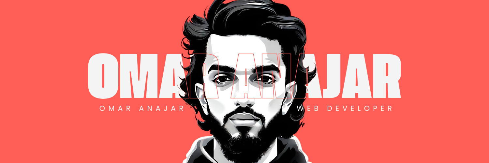

# I'm Omar | Full Stack Developer | Laravel & Vue.js 👋🏼: 
Passionate about building scalable and efficient web applications, I specialize in Laravel and Vue.js . With a strong background in backend and frontend development, I focus on crafting seamless user experiences and optimized performance.

# 💻 Tech Stack:
                    

<picture>
  <source media="(prefers-color-scheme: dark)" srcset="https://raw.githubusercontent.com/omaranajar/omaranajar/output/github-snake-dark.svg" />
  <source media="(prefers-color-scheme: light)" srcset="https://raw.githubusercontent.com/omaranajar/omaranajar/output/github-snake.svg" />
  
</picture>
